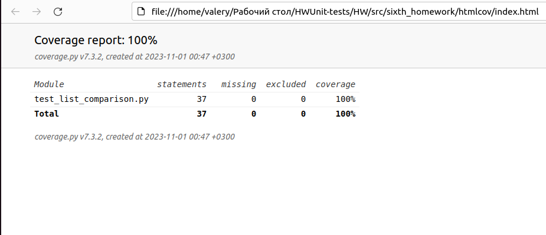
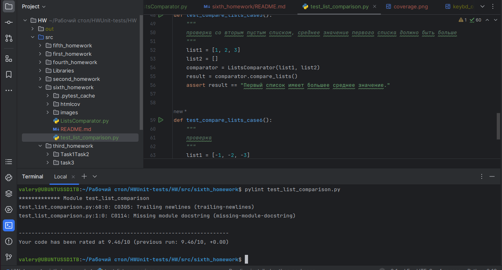
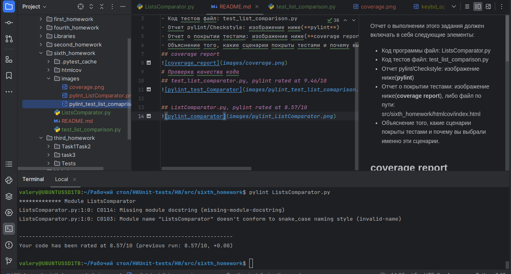

Отчет о выполнении этого задания включает в себя следующие элементы:
- Код программы файл:  [ListsComparator.py](ListsComparator.py)
- Код тестов файл: [test_list_comparison.py](test_list_comparison.py)
- Отчет pylint/Checkstyle: изображения ниже(**pylint**)
- Отчет о покрытии тестами: изображение ниже(**coverage report**), либо файл в директории /htmcov: [coverage](htmlcov/index.html)
- Объяснение того, какие сценарии покрыты тестами и почему вы выбрали именно эти сценарии.

## Отчет о покрытии тестами, coverage report:

* **test_compare_lists_first_larger()** - среднее значение первого списка боьше среднего значения второго списка 
* **test_compare_lists_second_larger()** - среднее значение второго списка должно быть больше среднего значения первого списка
* **test_compare_lists_same_values()** - средние значения каждого из списков должны быть равны
* **test_compare_lists_empty_lists()** - Провера на пустых списках
* **test_compare_lists_one_empty_list()** - проверка с одним пустым списком, среднее значение первого списка должно быть больше
* **test_compare_lists_negative_values()** - проверка списков с отрицательными числами
# Проверка качества кода pylint
## файл test_list_comparator.py, pylint rated at 9.46/10

## файл ListComparator.py, pylint rated at 8.57/10
